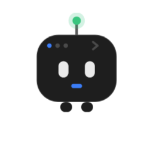

<div align="center">



# snippet

**An open-source AI coding agent that lives in your terminal — and that you can drive from your phone.**

One Rust binary: a durable terminal UI *and* a headless daemon you can remote-control over an authenticated tunnel. Bring your own model — Claude, GPT, Gemini, DeepSeek, a local model, or a ChatGPT subscription.

[](LICENSE)
[](#install)
[](https://www.rust-lang.org)
[](https://github.com/wacht-platform/snippet-mobile)

[Install](#install) · [Use the TUI](#use-the-tui) · [Remote control](#remote-control-from-anywhere) · [Models](#configure-your-models) · [How it works](#how-it-works) · [Mobile app](https://github.com/wacht-platform/snippet-mobile)

_Built by the team behind [Wacht](https://wacht.dev) — open-source infrastructure for AI-native apps._

</div>

---

`snippet` is a coding agent you actually own. It runs on your machine with full read/write/shell access to your project, keeps every session durable on disk, and — because the harness loop is fully decoupled from the UI — the **same engine** powers the on-device TUI and the `serve` daemon. Start a task at your desk, then check in, steer it, or kick off new work from your phone on the same session.

No cloud middleman, no lock-in, no subscription of ours. Your keys, your machine, your code.

## Features

- **Terminal-native** — a fast, durable TUI. Loop state is persisted (compressed msgpack) with automatic **checkpoints**, so you can resume any conversation exactly where you left off and **rewind** a bad turn.
- **Drive it from your phone or Mac** — run `snippet serve` on your dev box and control it from the [mobile/desktop app](https://github.com/wacht-platform/snippet-mobile) over an authenticated [cloudflared](https://github.com/cloudflare/cloudflared) tunnel: chat, browse & edit files, view git diffs, run commands, manage checkpoints.
- **Any model** — `anthropic`, `openai`, `gemini`, `openrouter`, `openai-compatible` (local models included), or a **ChatGPT subscription** (OAuth, no API key). Configure several providers as **profiles** and switch the active one — even **per conversation**.
- **Real tool surface** — read/write/edit, shell, recursive regex search, structural code mapping, image reading, and web search (with an Exa key).
- **Parallel sub-agents** — the agent orchestrates scoped work across background **lanes** that share the workspace and report back with exact `file:line` references, keeping its own context lean.
- **Agent Skills** — drop a `SKILL.md` folder in `~/.snippet/skills/`; the agent discovers and loads it on demand (the open [Agent Skills](https://agentskills.io) standard).
- **Background processes** — start dev servers / watchers detached; the agent tracks, tails, and kills them.
- **Runs indefinitely** — long histories **auto-compact** at a configurable threshold, and a persistent **memory** carries key facts across compactions, so a single session never hits a wall.
- **Self-updating** — the TUI checks for a newer release on launch; the daemon updates itself in place and restarts cleanly without dropping work.
- **Prompts as files** — every system-prompt layer lives in `prompts/` and is embedded at compile time. Tune the agent by editing Markdown, not Rust.

## Install

Linux and macOS (Apple Silicon).

**Prebuilt — one line:**

```sh
curl -fsSL https://wacht.dev/snippet.sh | sh
```

Detects your platform, fetches the latest release, and installs `snippet` to `~/.local/bin`. (Or download a tarball from [Releases](https://github.com/wacht-platform/snippet-service/releases).)

**From source** — requires [Rust](https://rustup.rs):

```sh
git clone https://github.com/wacht-platform/snippet-service
cd snippet-service
cargo run                  # builds + launches the TUI
cargo build --release      # optimized binary at target/release/snippet
```

First run drops you into an interactive model setup (including the ChatGPT-subscription OAuth flow) and writes your config for you. Then just describe a task.

**Run it as a login service** — auto-start `serve` on boot/login (systemd `--user` on Linux, launchd on macOS):

```sh
snippet serve --enable     # install the service, baking in the flags you pass
snippet serve --disable    # remove it
```

**Staying up to date** — the TUI checks for a newer release at startup and shows a one-line notice; the `serve` daemon checks periodically and swaps its own binary in place, restarting under its supervisor **without losing any session**. Opt out any time with `SNIPPET_NO_UPDATE=1`.

## Use the TUI

Describe a task in plain language and the agent plans, edits, runs, and verifies. Handy keys and slash-commands:

| Key / command      | Action                                                        |
| ------------------ | ------------------------------------------------------------- |
| `Up` / `Down`      | Walk input history                                            |
| `Ctrl-R`           | Resume a past conversation                                    |
| `/model`, `/models`| Switch the active model / list configured profiles            |
| `/mode`            | Toggle **manual approval** — confirm each edit & command      |
| `/compact`         | Compact the conversation history now                          |
| `/rewind`          | Rewind to an earlier checkpoint                               |
| `/new`             | Start a fresh conversation                                    |
| `/theme`           | Switch the color theme                                        |

The status bar shows the active model and a live context-usage gauge; sessions auto-compact before they fill.

## Remote control from anywhere

`serve` runs the agent headless and exposes it over an authenticated tunnel — purely additive, the on-device TUI is unaffected.

```sh
snippet serve              # fetches cloudflared if needed, opens a tunnel, forks to background
snippet serve --status     # reprint the QR / connection string
snippet serve --stop       # stop cleanly (tears the tunnel down)
```

It prints a **QR code + connection string** (`{url, token}`) — scan or paste it into the [**snippet mobile & desktop app**](https://github.com/wacht-platform/snippet-mobile) (Android + macOS) and you're driving your machine's agent from your pocket. Every endpoint is gated by a bearer token (constant-time comparison); secrets are stored `0600` and never returned by the API.

**Flags:** `--port` (default 8787) · `--token` (auto-generated) · `--host` (default `127.0.0.1`; use `0.0.0.0` for a fixed public IP) · `--no-tunnel` (localhost only) · `--public-url` (bring your own tunnel).

## Configure your models

Config lives at `~/.snippet/config.toml` (the TUI manages it for you). Keep several providers configured as **profiles** and switch freely — globally or per conversation.

| `provider`          | For                                                          | Auth                          |
| ------------------- | ----------------------------------------------------------- | ----------------------------- |
| `anthropic`         | Claude models                                               | `api_key`                     |
| `openai`            | GPT / o-series via the OpenAI API                           | `api_key`                     |
| `chatgpt`           | Your **ChatGPT** Plus/Pro subscription (OAuth)              | browser login — *no key*      |
| `gemini`            | Google Gemini                                               | `api_key`                     |
| `openrouter`        | Anything on OpenRouter                                       | `api_key`                     |
| `openai-compatible` | Local (Ollama / vLLM / LM Studio) or any OpenAI-shaped API  | `base_url` (+ optional `api_key`) |

```toml
active_setup = "anthropic"

[setups.anthropic]
provider = "anthropic"
model = "claude-opus-4-8"
api_key = "sk-ant-..."
reasoning_effort = "high"        # low | medium | high | off

[setups.gpt]
provider = "chatgpt"             # uses your ChatGPT subscription (OAuth) — no api_key
model = "gpt-5"

[setups.local]
provider = "openai-compatible"
base_url = "http://localhost:11434/v1"
model = "qwen2.5-coder"
supports_images = false          # set true for multimodal models
stream = true                    # some endpoints only emit output when streamed
```

Per-profile knobs include `reasoning_effort`, `temperature`, `supports_images`, `context_window` + `compact_at_pct` (when to auto-compact), `cache_prompt`, and `user_agent`. Set `exa_api_key` at the top level to enable web search. Set `assemblyai_api_key` at the top level to enable mobile voice transcription; the key is used only by the daemon and is not returned by `/config`. For example:

```toml
assemblyai_api_key = "..."
```

## How it works

```
                     ┌─────────────────────────────┐
      you, local  →  │        TUI (terminal)       │ ┐
                     └─────────────────────────────┘ │
                                                      ├─→   CodingHarness   ─→   ~/.snippet/
                     ┌─────────────────────────────┐ │     one durable           sessions,
   you, remote   →   │   serve daemon (HTTP + WS)   │ │     agent loop            checkpoints,
   phone / Mac app   │   + cloudflared tunnel       │ ┘                          memory, config
                     └─────────────────────────────┘
```

- **One engine, two front-ends.** The harness loop is UI-agnostic; the TUI and `serve` are thin shells over it, so a session started in either is the same on-disk session under `~/.snippet/workspaces/`.
- **Durable + resumable.** Every session persists loop state, history, and checkpoints — resume, rewind, or attach from another device.
- **Layered prompts.** `prompts/{operating_style,sandbox_environment,artifact_discipline,coding_agent_layer,conversation_agent_layer}.md` are composed into the system prompt; per-turn steering is injected fresh each turn (kept out of the cached prefix for token efficiency).
- **Tools:** `read_file`, `read_image`, `write_file`, `append_file`, `edit_file`, `replace_file_content`, `list_files`, `search_files`, `search_content` (regex), `view_outline`, `code_map`, `bash` (+ `background`), `search_skills`/`skill`, and `delegate_task` for parallel lanes.

## Security

- **Token-gated.** Every `serve` endpoint requires a bearer token, compared in constant time. The tunnel URL alone gets you nothing.
- **Secrets stay secret.** API keys and the serve token are written `0600` and are **never** returned by the API, logged, or printed.
- **Your machine only.** Nothing runs in our cloud; the app talks directly to *your* daemon.
- **AGPL network clause.** Because `serve` is a network service, running a modified version for others obliges you to offer them its source (see [License](#license)).

## Mobile & desktop app

The remote client lives in its own repo → [**wacht-platform/snippet-mobile**](https://github.com/wacht-platform/snippet-mobile) (Android + macOS). Grab the APK, scan the QR from `snippet serve`, and you're connected.

## From the team behind Wacht

snippet is an open-source project from **[Wacht](https://wacht.dev)** — open-source infrastructure for AI-native apps: identity, organizations, machine auth, webhooks, notifications, and an agent runtime, built as one product on one model instead of six vendors stitched together.

If you're building AI-native apps, that's where to look next → **[wacht.dev](https://wacht.dev)**.

## Contributing

Contributions welcome — see [CONTRIBUTING.md](CONTRIBUTING.md). `cargo build` must pass before a PR.

## License

Copyright (C) 2026 snipextt. Licensed under the **GNU Affero General Public License v3.0 or later** (AGPL-3.0-or-later) — see [LICENSE](LICENSE). Because `serve` can run as a network service, the AGPL's network-use clause applies: if you run a modified version for others over a network, you must offer them its source.
