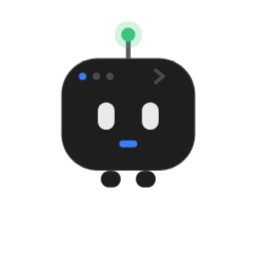

<div align="center">



# snippet

**An open-source AI coding agent for your terminal, with a remote app for your phone and desktop.**

[](LICENSE)
[](https://www.rust-lang.org)
[](https://github.com/wacht-platform/snippet-mobile)

</div>

---

`snippet` runs on your machine, works in your project, and keeps sessions durable on disk. The Rust binary provides both the terminal UI and the authenticated `serve` daemon. The companion Flutter app can attach to the same sessions remotely.

## What it does

- Durable coding sessions with checkpoints, rewind, history compaction, and persistent workspace memory.
- Read, write, edit, search, shell, browser-control, file, git, and web-search tools.
- Multiple provider profiles with global and per-conversation model selection.
- Anthropic, OpenAI, Gemini, OpenRouter, OpenAI-compatible endpoints, local models, and ChatGPT subscription login.
- Delegated background lanes with live progress and recovery after reconnects.
- Detached background processes for servers and watchers.
- Optional Chrome/Firefox browser extension control through the `snippet browser` CLI.
- Remote control through the companion Android, macOS, and Windows app.

## Install

### Prebuilt Linux or macOS binary

```sh
curl -fsSL https://wacht.dev/snippet.sh | sh
```

Or download a package from the [service releases](https://github.com/wacht-platform/snippet-service/releases).

### Build from source

Requires [Rust](https://rustup.rs).

```sh
git clone https://github.com/wacht-platform/snippet-service.git
cd snippet-service
cargo run                  # build and start the TUI
cargo build --release      # target/release/snippet
```

The first run opens model setup and writes `~/.snippet/config.toml`.

## Use the terminal UI

Start the agent with:

```sh
snippet
```

Useful commands and keys include:

| Command / key | Action |
| --- | --- |
| `/new` | Start a new conversation |
| `/model` or `/models` | Select a configured model profile |
| `/mode` | Toggle manual approval |
| `/compact` | Compact history immediately |
| `/rewind` | Restore a checkpoint |
| `/theme` | Change the UI theme |
| `Ctrl-R` | Resume a previous conversation |
| `Ctrl-A` | Open delegated-lanes activity |

## Remote control with `serve`

Run the daemon on the machine that owns the project:

```sh
snippet serve                 # start the daemon and tunnel
snippet serve --status        # show the current connection details
snippet serve --stop          # stop the daemon and tunnel
snippet serve --no-tunnel     # localhost-only mode
```

`serve` prints a QR code and a connection string containing a URL and token. Add that connection in the [companion app](https://github.com/wacht-platform/snippet-mobile). The daemon exposes authenticated HTTP endpoints and WebSockets for sessions, live state, streams, terminals, device events, and paginated transcript history over the existing session attachment socket.

Useful flags include `--port` (default `8787`), `--host`, `--token`, `--no-tunnel`, and `--public-url`.

To install or remove a login service:

```sh
snippet serve --enable
snippet serve --disable
```

## Configure model profiles

Configuration is stored at `~/.snippet/config.toml`. The TUI and remote app can manage profiles; several profiles may coexist and can be selected per conversation.

```toml
active_setup = "anthropic"

[setups.anthropic]
provider = "anthropic"
model = "claude-opus-4-8"
api_key = "sk-ant-..."
reasoning_effort = "high"       # off | low | medium | high

[setups.local]
provider = "openai-compatible"
base_url = "http://localhost:11434/v1"
model = "qwen2.5-coder"
stream = true
supports_images = false
```

Supported provider values include `anthropic`, `openai`, `chatgpt`, `gemini`, `openrouter`, and `openai-compatible`. Profile settings also cover temperature, image support, context size, compaction thresholds, prompt caching, and user-agent options.

Optional top-level integrations include `exa_api_key` for web search and `assemblyai_api_key` for remote voice transcription. Keys remain on the daemon and are not returned by the configuration API.

## Data and security

- Sessions and configuration stay on the host running `snippet`.
- Remote access is token-gated; tokens are compared in constant time.
- Secrets are stored with restricted permissions and are never returned by `/config`.
- The tunnel URL alone does not grant access.
- `--no-tunnel` is available for local-only operation.

## Architecture

```text
terminal user ───────┐
                     ├── durable harness ── ~/.snippet/
remote app ─ serve ──┘
```

The terminal UI and remote app use the same persisted session state. The `serve` daemon sends live snapshots/deltas and stream frames over `/attach`; older transcript pages are requested on that same WebSocket with a `history` message. Device-wide notifications use `/events`.

## Development

```sh
cargo check --lib --offline
cargo test --lib --offline
cargo build --release
```

Contributions are welcome. See [CONTRIBUTING.md](CONTRIBUTING.md).

## Companion app

Download the current Android, macOS, or Windows client from the [snippet app releases](https://github.com/wacht-platform/snippet-mobile/releases/tag/latest).

## License

Copyright (C) 2026 snipextt. Licensed under the [GNU Affero General Public License v3.0 or later](LICENSE).
